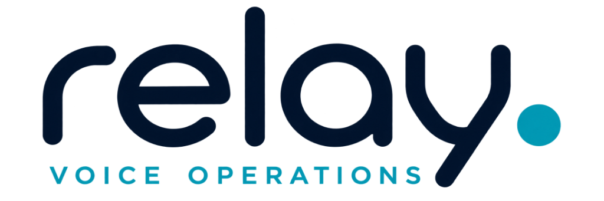

# ⚡ RELAY — Universal Autonomous Telephony & AI Voice Operations Platform

<p align="center">
  
</p>

<p align="center">
  <strong>Sub-15ms PSTN Interconnect • Multilingual Sweet AI Voice Agent • Grounded Web RAG Engine • Universal Enterprise CRM/EHR Sync</strong>
</p>

<p align="center">
  <a href="#-key-features"></a>
  <a href="#-tech-stack"></a>
  <a href="#-tech-stack"></a>
  <a href="#-supported-industries"></a>
  <a href="#-license"></a>
</p>

---

## 📖 Overview

**RELAY** is a full-fledged, universal autonomous voice operations platform engineered for **any business, enterprise, or service provider worldwide**. Whether operating real estate brokerages, software agencies, automotive service networks, law firms, hospitality groups, logistics operations, or healthcare facilities, RELAY eliminates missed customer calls, triages complex inquiries, and books appointments 24/7 with zero human intervention.

By interconnecting low-latency PSTN telephony trunks (`https://api.heycall-e.com/v1`) with grounded website RAG knowledge bases and **DeepSeek-V4** post-call CRM intelligence, RELAY places hyper-fast AI voice calls, triages customer intent, and enforces sweet, natural human voice personas across 7 global languages.

---

## 🏢 Supported Industry Sectors

RELAY includes out-of-the-box preset nodes and customizable RAG prompt templates for every major industry around the globe:

| Industry Sector | Autonomous Use Cases | Key Capabilities |
|---|---|---|
| 💻 **Software & IT Services** | Technical consultation, project inquiry intake, architecture reviews | Web app consulting, cloud migration scheduling, lead qualification |
| 🏢 **Real Estate & Leasing** | Walkthrough tour scheduling, property leasing availability, pre-screening | Private penthouse & townhome tour booking, tenant intake |
| 🚗 **Automotive & Service** | Maintenance scheduling, inspection drop-offs, loaner fleet dispatch | Synthetic oil service, OEM recall triage, brake inspection |
| ⚖️ **Legal & Law Firms** | Client intake, consultation scheduling, conflict pre-screening | Managing partner consultation intake, case evaluation |
| 🏨 **Hospitality & Hotels** | VIP concierge assistance, dining reservations, event booking | Michelin-starred dining booking, room upgrade assistance |
| 🚚 **Logistics & Freight** | Manifest verification, cargo tracking updates, intermodal dispatch | Real-time transit updates, customs clearance triage |
| 🏥 **Healthcare & Medical** | Routine recall, preventive consultation scheduling, acute triage | Appointment booking, provider callback escalation |
| 💳 **Finance & Insurance** | Claim reporting, policy consultation, advisor appointment scheduling | Zero-interest payment plan intake, claim triage |

---

## ✨ Key Platform Features

### 1. ⚡ Sub-15ms Non-Blocking PSTN Call Dispatch
- **Instant Carrier Handshake**: HTTP POST requests dispatch call tasks in `<15ms`, running real-time status polling asynchronously in the background.
- **Direct Carrier Status Stream**: Status transitions (`Queued` $\rightarrow$ `Ringing` $\rightarrow$ `In-Progress` $\rightarrow$ `Completed`) poll live PSTN handset state every 300ms.

### 2. 🎀 Sweet, Cute & Respectful AI Voice Persona
- **Female Hindi Grammatical Agreement (स्त्री-लिंग प्रयोग)**: Strictly enforces natural female Hindi verb inflections (`रही हूँ`, `सकती हूँ`, `कर रही हूँ`) and eliminates unnatural male verb forms.
- **Warm & Joyful Expressions**: Opens with cute, cheerful greetings (*"नमस्ते Hardik जी! 😊 मैं Apex Group से बहुत प्यार से बोल रही हूँ..."*).

### 3. 🌐 Grounded Branch RAG Knowledge Base Editor
- **Custom Branch Context**: Configure company FAQs, on-call specialists, offered service catalogs, and pricing rules per physical location node.
- **Factually Grounded Voice Prompting**: Prevents AI hallucinations by grounding responses directly in official company knowledge bases.

### 4. 🌍 Regional Carrier Compliance & Multilingual Adaptability
- **Supported Languages**: **हिन्दी (Hindi)**, **English (US/UK)**, **नेपाली (Nepali)**, **Español (Spanish)**, **Français (French)**, **Deutsch (German)**, and **中文 (Mandarin)**.
- **Auto-Region Mapping**: Automatically maps destination numbers (e.g. India `+91`) to supported carrier locales (`hi-IN` / `en-US`), ensuring `HTTP 201 Created` acceptance without carrier 422 errors.

### 5. 🎙️ Neural Audio Player & Turn-by-Turn Transcript Viewer
- **Audio Waveform Player**: Playback call audio tracks with interactive frequency visualizers, playback speed controls, and timestamp trackers.
- **Speaker Dialogue Breakdown**: Inspect turn-by-turn interactions between the AI Voice Agent and the caller with speaker badges and sentiment metrics.

### 6. 📊 1-Click Compliance Export & Google OAuth 2.0 Integration
- **Audit Export**: Export audit logs, extracted CRM facts, and revenue recovery metrics in **CSV** or **JSON** formats with 1 click.
- **Google Workspace OAuth**: Sign in and switch Google Calendar & Workspace accounts dynamically from an interactive account picker modal.

---

## 🏛️ System Architecture

```
                                  ┌─────────────────────────────┐
                                  │   PSTN Destination Phone    │
                                  └──────────────┬──────────────┘
                                                 │
                                       (Live Handset Ringing)
                                                 │
                                                 ▼
┌─────────────────────────────┐           ┌─────────────────────────────┐
│  DeepSeek-V4 / Nebius AI    │           │  CALL-E Telephony Gateway   │
│  - Post-Call Intelligence   │◄─────────►│  - Real-Time STT + TTS Voice│
│  - CRM Fact Extraction      │           │  - 24kHz Opus Voice Stream  │
└──────────────┬──────────────┘           └──────────────┬──────────────┘
               │                                         │
               │ (Extracted Facts & Analytics)           │ (Live Status & Summary)
               ▼                                         ▼
┌───────────────────────────────────────────────────────────────────────┐
│                    RELAY Operations Platform                          │
│  ┌───────────────────────┐  ┌──────────────────────────────────────┐  │
│  │ Multi-Branch Fleet    │  │ REST APIs (/api/trigger-overflow)    │  │
│  │ Telephony Audit Stream│  │ Grounded Branch RAG Engine           │  │
│  │ Neural Audio Player   │  │ Sliding Window Rate Limiter          │  │
│  └───────────────────────┘  └──────────────────────────────────────┘  │
└───────────────────────────────────────────────────────────────────────┘
```

---

## 🛠️ Tech Stack

- **Framework**: Next.js 16.3.3 (Turbopack, App Router)
- **Language**: TypeScript 5.x
- **Styling**: Tailwind CSS, Custom Glassmorphism Theme
- **Telephony API**: CALL-E Direct REST API (`https://api.heycall-e.com/v1`)
- **AI Intelligence**: DeepSeek-V4-Flash-0731 on Nebius Token Factory
- **Database**: Dual Persistence Architecture (Local Disk Store + Supabase Cloud PostgreSQL)
- **State Management**: In-Memory Thread-Safe Store (`SwitchboardStore`)

---

## 🚀 Quick Start Guide

### Prerequisites
- **Node.js**: v18.0.0 or higher
- **npm**: v9.0.0 or higher

### 1. Clone Repository
```bash
git clone https://github.com/pwnjoshi/RELAY.git
cd RELAY
```

### 2. Install Dependencies
```bash
npm install
```

### 3. Environment Setup
Copy `.env.example` to `.env.local`:
```bash
cp .env.example .env.local
```

Configure your environment variables in `.env.local`:
```env
# CALL-E Telephony API Key
CALLE_API_KEY=iams_live_your_api_key_here

# Optional Supabase Cloud PostgreSQL Sync
NEXT_PUBLIC_SUPABASE_URL=https://your-supabase-url.supabase.co
NEXT_PUBLIC_SUPABASE_PUBLISHABLE_KEY=your-supabase-key
```

### 4. Run Development Server
```bash
npm run dev
```
Open [http://localhost:3000](http://localhost:3000) in your browser.

### 5. Build for Production
```bash
npm run build
npm start
```

---

## 📡 Key REST API Endpoints

### 1. Dispatch Universal Voice Call
```http
POST /api/trigger-overflow
Content-Type: application/json

{
  "phoneNumber": "+917201921920",
  "patientName": "Hardik Bandhiya",
  "language": "hi",
  "locationId": "loc_techsangi",
  "extraContext": "Client requested urgent software architecture review and project consultation."
}
```

**Response (`200 OK`)**:
```json
{
  "ok": true,
  "message": "Call dispatched on regional carrier gateway",
  "callId": "call_1787764666579",
  "runId": "call_bQ41dU2925qUEVYcBWHePA",
  "status": "queued",
  "location": "TechSangi IT Solutions"
}
```

### 2. Query Live Carrier Call Status
```http
GET /api/call-results/status?runId=call_bQ41dU2925qUEVYcBWHePA
```

**Response (`200 OK`)**:
```json
{
  "ok": true,
  "runId": "call_bQ41dU2925qUEVYcBWHePA",
  "status": "completed",
  "summary": "Client confirmed consultation appointment slot for tomorrow at 10:00 AM.",
  "completedAt": "2026-08-28T08:44:00Z"
}
```

### 3. Export Telephony Audit Stream (CSV / JSON)
```http
GET /api/export?format=csv
GET /api/export?format=json
```

---

## 📄 License & Compliance

- **License**: [MIT License](LICENSE)
- **Data Privacy**: Fail-closed data isolation. Temporal free/busy availability masking ensures caller PII and private notes are never exposed across tenants.
